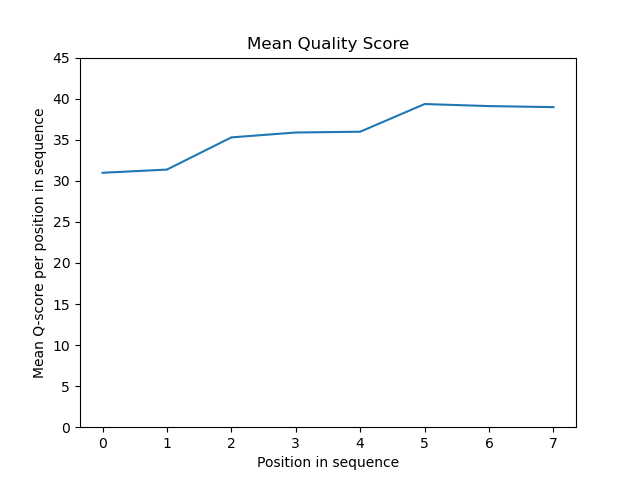

# Assignment the First

## Part 1
1. Be sure to upload your Python script. Provide a link to it here: https://github.com/Dovezella/Demultiplex/blob/master/Assignment-the-first/baseq_hist.py

| File name | label | Read length | Phred encoding |
|---|---|---|---|
| 1294_S1_L008_R1_001.fastq.gz | read 1 | 101 bp  | 33  |
| 1294_S1_L008_R2_001.fastq.gz | index 1 | 8 bp | 33 |
| 1294_S1_L008_R3_001.fastq.gz | index 2 | 8 bp | 33 |
| 1294_S1_L008_R4_001.fastq.gz | read 2 | 101 bp | 33 |

2. Per-base NT distribution
    1. Read 1
        Index 1
        Index 2
        Read 2
    2. I think that a quality score cutoff would be 30 as anything less than this would not be very reliable, and everything that we see in our distributions are above this level. So if we were to go higher then we would lose valuable information especially for our indices. 
    3.  
        ```zcat /projects/bgmp/shared/2017_sequencing/1294_S1_L008_R3_001.fastq.gz | sed -n '4~4p' | grep -E "[#]" | wc -l``` 
        which returned 3328051
        ```zcat /projects/bgmp/shared/2017_sequencing/1294_S1_L008_R2_001.fastq.gz | sed -n '4~4p' | grep -E "[#]" | wc -l``` 
        which returned 3976613
        for a total of 7304664 from both index 1 and 2 files (R2 and R3)
## Part 2
1. Define the problem:  We need to be able to parse through each file for R1-4 to identify their barcodes. For every corresponding record we need to see whether the barcodes match, show index hopping, or if they have low quality or an unknown barcode.
2. Describe output:
For each read-pair:			Outputs
	If properly matched indexes: 	R1.match.fastq, R2.match.fastq (2 files/every individual index) 
	If index-hopped:		R1.hop.fastq, R2.hop.fastq
	If index-	unknown:		R1.unk.fastq, R2.unk.fastq

3. Upload your [4 input FASTQ files](../TEST-input_FASTQ) and your [>=6 expected output FASTQ files](../TEST-output_FASTQ).
4. Pseudocode
Define Reverse compliment function
Assign variables to each file to be able to reference them 
Make a directory of all index combinations as keys and file names as the values so you can write to them by referencing the directory 
Initiate 4 empty lists, one to hold record from read 1, one for record from read 2, one for each index line from R2 and R3
Open all four files at the same time to read:
As you read the lines: go one record at a time and save it temporarily in respective list:
	Grab index 1 (file R2) and grab index 2 (file R3):
		For index 2, reverse complement it
			If “N” in index:
			Write to new R1.unk.fq w/appended header “index1:index2(RC)”
			Write to new R2.unk.fq w/appended header “index1:index2(RC)”
			If index 1 == index 2: 
Write read 1 to new R1.match.fq w/ “index1:index2(RC)” added to end of header
Write read 2 to new R2.match.fq w/”index1:index2(RC)” added to end of header
If index 1 != index 2:
Write same way but to R1 or R2.hop.fq
Empty lists
Finally output:  record count of matched files (wc -l /4), record count of unknowns (wc -l /4), and number of unique index-hopping combinations (counter for every instance of combination) and the count of records in hop file (wc -l /4)

5. High level functions. For each function, be sure to include:
    1. Description/doc string
    2. Function headers (name and parameters)
    3. Test examples for individual functions
    4. Return statement
def rev_comp(index2: str) -> str:
    ```This function will take index 2 and returns the reverse complement of the sequence```
    return revcomp_index2
Input: TCGGCTGTT
Expected output: AACAGCCGA 
